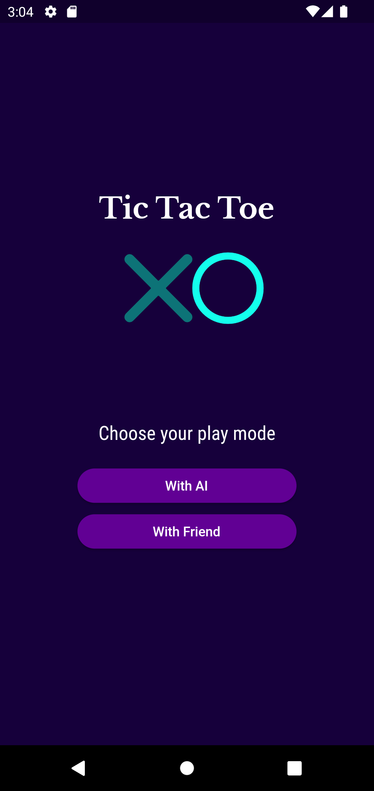
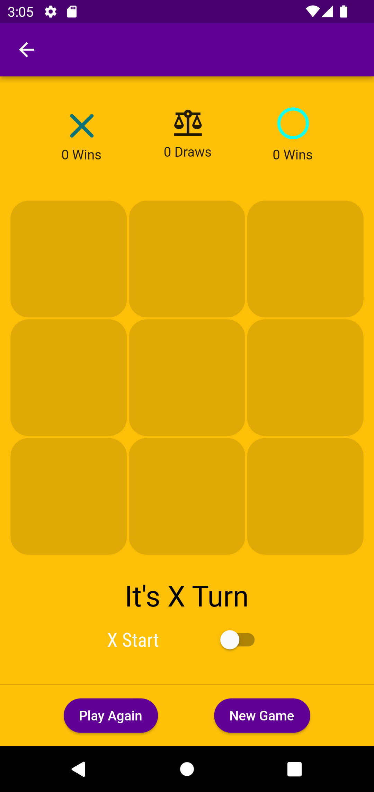
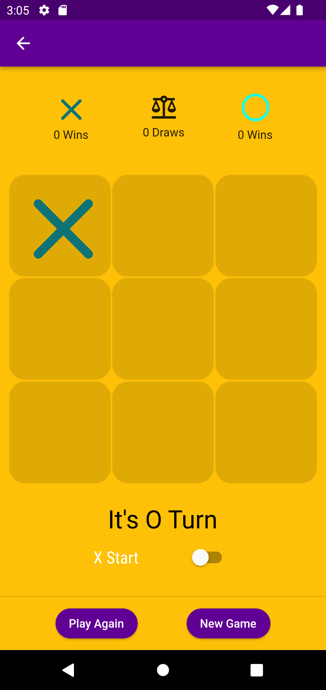
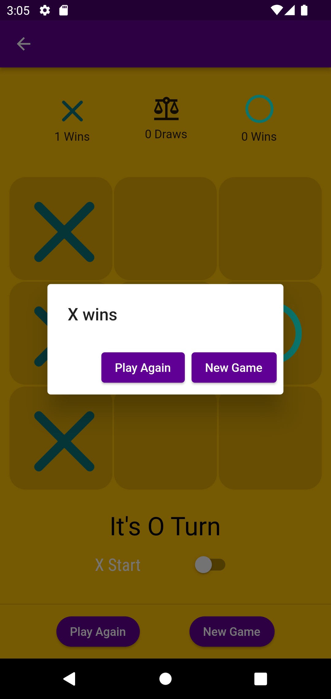
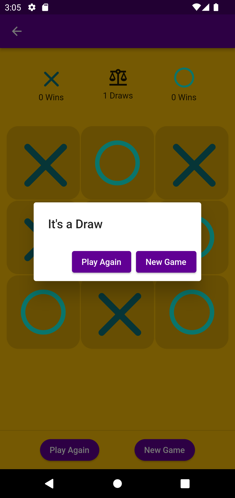
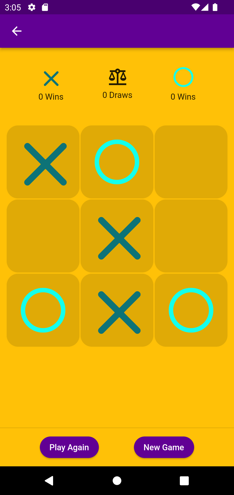

# TicTacToe with flutter

This is my first flutter project, the aim of the project is to get used to programming in flutter, and to memorize the material from a flutter online course i was taking.

Its a simple tictactoe game with 2 modes, one if for playing "vs friend" other "vs pc", in the future i would like to make the "vs pc" mode have difficulty levels

## Getting Started 
**1. [ Setup Flutter](https://flutter.io/setup/)**

**2. Clone the repo**

```sh
$ git clone https://github.com/Haroun207/TTTflutter.git
```

**3. Install dependencies**
```sh
$ flutter pub get
```

**4. Run app**
```sh
$ flutter run
```

## Screenshots 📷
 &nbsp;&nbsp;&nbsp;&nbsp;  &nbsp;&nbsp;&nbsp;&nbsp;  
  &nbsp;&nbsp;&nbsp;&nbsp;   &nbsp;&nbsp;&nbsp;&nbsp; 


## Technologies
[](https://flutter.dev/)   
[](https://dart.dev/) 


## Contact Me 
- Gmail: (salemharoun@gmail.com)
- LinkedIn: (https://www.linkedin.com/in/haroun-salem-3212491b1/)

